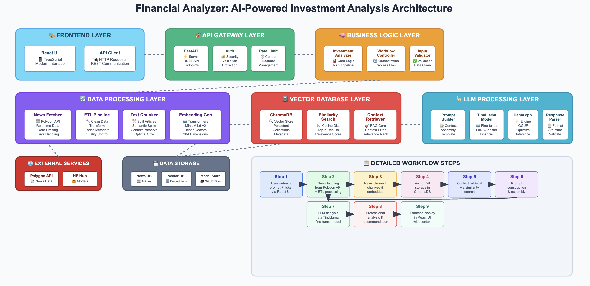

# Financial Analyst: Investment Analyzer

<div align="center">


</div>

<div align="center">

[](https://huggingface.co/guptatilak/finanical-analyst)


</div>

<div align="center">

**🤖 RAG** • **🦙 TinyLlama** • **🔗 llama.cpp** • **📊 Financial Analysis** • **🔍 Sentence Transformers** • **⚡ LoRA/QLoRA**

</div>

---

## Project Overview

**Financial Analyst** is an AI-powered investment analysis platform that leverages real-time financial news, advanced embeddings, and a fine-tuned Large Language Model (LLM) to provide actionable investment advice. The system is designed to:
- Fetch and process the latest news for any stock ticker
- Store news in a vector database using state-of-the-art embeddings
- Retrieve the most relevant news for a user's query
- Pass this context, along with the user's prompt, to a fine-tuned LLM for professional financial analysis and recommendations


---

## 🛠️ Tech Stack

### Core Technologies
- **🐍 Python 3.8+** - Backend development and ML pipeline
- **⚛️ React + TypeScript** - Modern frontend interface
- **🚀 FastAPI** - High-performance REST API framework
- **🦙 TinyLlama-1.1B** - Fine-tuned base language model
- **🔗 llama.cpp** - Efficient LLM inference engine

### Machine Learning & AI
- **🤗 Transformers** - Model loading and fine-tuning
- **📊 Sentence Transformers** - Text embeddings (MiniLM-L6-v2)
- **⚡ PEFT (LoRA/QLoRA)** - Parameter efficient fine-tuning
- **🎯 TRL** - Transformer reinforcement learning
- **🔍 RAG** - Retrieval-augmented generation pipeline

### Data & Storage
- **🗄️ ChromaDB** - Vector database for embeddings
- **🐼 Pandas** - Data manipulation and analysis
- **🔢 NumPy** - Numerical computations
- **📈 Polygon API** - Real-time financial news data

### Development & Deployment
- **📦 Uvicorn** - ASGI server for FastAPI
- **📱 Node.js** - Frontend build tools
- **🔧 Git** - Version control
- **🐳 Docker Ready** - Containerization support

---

## Setup & Usage

### 1. Download the Fine-Tuned Model
- Download the fine-tuned model file (`TinyLlama-1.1B-Financial-LoRA_f16.gguf`) from the [Hugging Face Hub](https://huggingface.co/guptatilak/finanical-analyst/tree/main).
- Place the downloaded `.gguf` file in the `model/gguf_models` directory of this project.

### 2. Test the Model Locally (LLM Only)
- To test the model locally with the investment analyzer pipeline, run:
  ```bash
  python3 llm_test_api.py
  ```
- Then, send a POST request to the model:
  ```bash
  curl -X POST http://localhost:5001/analyze -H "Content-Type: application/json" -d '{"prompt": "How do interest rate changes affect stock market valuations?"}'
  ```

### 3. Test Only the Investment Analyzer Pipeline
- To test the investment analyzer pipeline (without the full backend/frontend stack), run:
  ```bash
  PYTHONPATH=. python3 src/analysis/investment_analyzer.py
  ```

### 4. Run the Complete Investment Analyzer (Backend + Frontend)
- **Backend:**
  ```bash
  pip install -r requirements.txt
  uvicorn api:app --reload
  ```
- **Frontend:**
  ```bash
  cd frontend/investment-analyzer-ui && npm install && npm start
  ```

---

## Key Concepts & Architecture



### 1. News Fetching & ETL Pipeline
- **Source:** Real-time news is fetched using the Polygon API (and can be extended to other sources).
- **ETL:** News articles are cleaned, transformed, and enriched with metadata (title, content, date, source, keywords, etc.).
- **Rate Limiting:** The pipeline respects API rate limits and uses exponential backoff with jitter for reliability.

### 2. Embedding Generation & Vector Database
- **Embeddings:** Each news chunk is converted into a dense vector using `sentence-transformers` (MiniLM-L6-v2).
- **Vector DB:** Embeddings and metadata are stored in a persistent [ChromaDB](https://www.trychroma.com/) instance, enabling fast similarity search.
- **Chunking:** News articles are split into manageable chunks for better retrieval granularity.

### 3. Retrieval-Augmented Generation (RAG)
- **Query:** When a user asks a question about a stock, the system retrieves the most relevant news chunks from the vector DB.
- **Prompt Construction:** The retrieved news is combined with a system prompt and the user's question to form a context-rich prompt for the LLM.
- **LLM Response:** The fine-tuned LLM generates a tailored analysis and recommendation based on the latest news context.

### 4. LLM Finetuning
- **Base Model:** [TinyLlama-1.1B-Chat-v1.0](https://huggingface.co/TinyLlama/TinyLlama-1.1B-Chat-v1.0)
- **Finetuning Method:** QLoRA/LoRA with PEFT and TRL libraries for efficient, low-resource adaptation
- **Dataset:** Financial instruction datasets (e.g., Finance Alpaca) and custom Q&A pairs
- **Prompt Format:** System, user, and assistant roles in TinyLlama chat format
- **Training Details:**
  - Quantization: 4-bit (nf4), FP16 compute
  - LoRA rank: 8, alpha: 16, dropout: 0.05, RSLoRA enabled
  - Batch size: 8, Gradient Accumulation: 2, Epochs: 2, Max steps: 500
  - Learning rate: 2e-4, Optimizer: AdamW
  - Max sequence length: 1024

## LLM Finetuning Details

**Notebook:** `notebooks/finetuning-tinyllama-1-1b-chat-v1-0.ipynb`

- **Model:** TinyLlama/TinyLlama-1.1B-Chat-v1.0
- **LoRA Config:**
  ```python
  LoraConfig(
      task_type=TaskType.CAUSAL_LM,
      r=8,
      lora_alpha=16,
      target_modules=["q_proj", "v_proj"],
      lora_dropout=0.05,
      bias="none",
      use_rslora=True,
      inference_mode=False,
  )
  ```
- **Training Args:**
  ```python
  TrainingArguments(
      output_dir="./results/TinyLlama-1.1B-Financial-LoRA",
      per_device_train_batch_size=8,
      gradient_accumulation_steps=2,
      num_train_epochs=2,
      max_steps=500,
      learning_rate=2e-4,
      fp16=True,
      logging_steps=25,
      save_steps=50,
      evaluation_strategy="steps",
      eval_steps=50,
      warmup_steps=25,
      lr_scheduler_type="linear",
      optim="adamw_torch",
      weight_decay=0.01,
      max_grad_norm=0.3,
      group_by_length=True,
      dataloader_pin_memory=True,
      dataloader_num_workers=2,
      remove_unused_columns=False,
      gradient_checkpointing=False,
      report_to=None,
      save_total_limit=2,
      load_best_model_at_end=False,
  )
  ```
- **Prompt Format Example:**
  ```
  <|system|>
  You are a helpful financial analyst assistant.
  <|user|>
  What are the key financial ratios for stock analysis?
  <|assistant|>
  Key financial ratios include P/E ratio, P/B ratio, ROE, ROA, debt-to-equity ratio, current ratio, and profit margins. These help evaluate profitability, liquidity, and financial health.
  ```
- **Conversion:**
  - After finetuning, convert the model to GGUF format for use with llama.cpp
  - Download the GGUF file and place it in `model/gguf_models/`

---

## Use Cases

- **Market Sentiment Analysis:**
  - "What is the current sentiment around TSLA based on the latest news?"
- **Event Impact:**
  - "How do recent interest rate changes affect bank stocks?"
- **Company Outlook:**
  - "What are the latest developments and outlook for AAPL?"
- **Risk Assessment:**
  - "Are there any major risks highlighted in recent news for NVDA?"

---

## Additional Notes

- **Requirements:**
  - Python 3.8+
  - Node.js (for frontend)
  - Polygon API key (set in `config/settings.py`)
- **Troubleshooting:**
  - Ensure the model file is in the correct directory and named appropriately
  - Check API keys and rate limits for news fetching

---

<div align="center">

**⭐ Star this repo if you find it useful!**

For more details, see the code, finetuning notebook, and comments throughout the repository

</div>